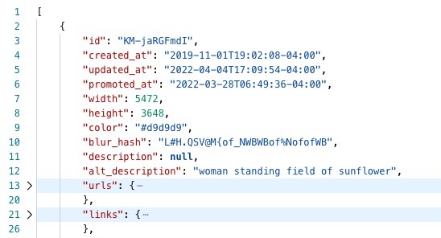

# Unsplash API

- Unsplash API can retrieve images from the websites
- To use this API in PHP

```
Route::get('/unsplash', function() use {$count} {
    return Http::withHeaders([
        'Authorization' => "Client-ID" . env('UNSPLASH_ACCESS_KEY'),
    ])
        ->get("https://api.unsplash.com/photos/random?count=$count")
        ->json();
});
```

- To retrieve the access key, register as a developer at https://unsplash.com/developers. Then go to Your applications and click New Application to create an app. Inside the app scroll down until the Keys section. Copy the Access Key and store it in the env file of the project.
- JSon response  
  
